# Expense Management

A multi-user, group-based expense-splitting and settlement platform — the
kind of problem Splitwise solves. People create groups, log shared
expenses with flexible split rules, and the system keeps a running,
directional debt ledger per currency so everyone always knows who owes
whom, and by how much.

The backend is a Spring Boot REST API backed by PostgreSQL, with JWT
authentication, rate limiting, structured logging, and a Testcontainers
integration test suite. The frontend is a React/TypeScript single-page
app.


---

## ⭐ Highlights

- Full-stack Splitwise-style expense management application
- Stateless JWT authentication with password hashing
- Directional, per-currency debt ledger with an immutable audit trail
- Three configurable expense split strategies (Equal / Exact / Percentage)
- Idempotency-key support on financial write endpoints
- PostgreSQL + Flyway-managed schema, fully Dockerized
- Integration tests run against a real Postgres instance via Testcontainers
- React 19 + TypeScript frontend with client-side dashboard analytics

---

## 🎥 Project Demo

> _Record a short screen capture (GIF or video) walking through:
> registration → login → create group → add members → create an equal-split
> expense → create an exact-split expense → create a percentage-split
> expense → view balances → partial settlement → full settlement →
> dashboard update. Embed it here once recorded._

```
[Demo GIF/video placeholder]
```

---

## Features

**Authentication & Security**
- JWT-based authentication (stateless, no server-side session)
- Password hashing, role field on users (`USER` / `ADMIN`)
- Per-endpoint authorization — protected routes require a valid bearer token
- Rate limiting on login and registration (configurable thresholds/windows)
- CORS configured for the frontend origin

**Groups & Members**
- Create groups with an initial member list
- List the groups the authenticated user belongs to
- View group detail (members, join dates)
- Add members to an existing group (by user ID, resolved via email lookup on the frontend)
- Remove a member — blocked if they still have an outstanding balance in that group, to avoid orphaning unsettled debt

**Expenses**
- Create, view, update, and delete expenses
- Three split strategies: **Equal**, **Exact amount**, and **Percentage**
- Idempotency-key support on expense creation, so a retried request can't create a duplicate
- Full validation per split type (e.g. exact amounts must sum to the total, percentages must sum to 100, no duplicate participants)

**Balances & Settlements**
- Directional, per-currency debt ledger, automatically maintained on every expense and settlement
- Full settlement (debt fully paid, balance row cleared)
- Partial settlement (balance reduced, same direction preserved)
- Overpayment handling (debt direction flips with a residual)
- Settlement history per group
- Full audit trail via a balance history table

**Dashboard**
- Client-side aggregated view of total owed, total owing, net balance, and recent activity across all of a user's groups
- Monthly spending and expense-distribution charts

**Profile**
- View authenticated user's own profile
- Email lookup for inviting existing users to a group

**Engineering**
- PostgreSQL with Flyway-managed schema migrations
- Docker & Docker Compose for one-command local startup
- Structured (JSON) request logging with request IDs
- Centralized exception handling with consistent error response shapes
- Bean Validation on all request DTOs
- Integration tests run against a real PostgreSQL instance via Testcontainers, covering split strategies, settlement (full/partial), rollback behavior, and idempotency

---

## Tech Stack

**Backend**
| | |
|---|---|
| Language | Java 21 |
| Framework | Spring Boot 3.5 (Web, Security, Validation, JDBC) |
| Build | Maven |
| Database | PostgreSQL 16 |
| Migrations | Flyway |
| Containerization | Docker / Docker Compose |

**Frontend**
| | |
|---|---|
| Framework | React 19 |
| Language | TypeScript |
| Build tool | Vite |
| HTTP client | Axios |
| Server state | TanStack Query |
| Routing | React Router |
| Forms & validation | React Hook Form + Zod |
| Styling | Tailwind CSS |

**Testing**
| | |
|---|---|
| Backend | JUnit 5, Spring Boot Test, Testcontainers (PostgreSQL) |
| Frontend | Vitest, React Testing Library, Playwright (E2E) |

---

## Architecture

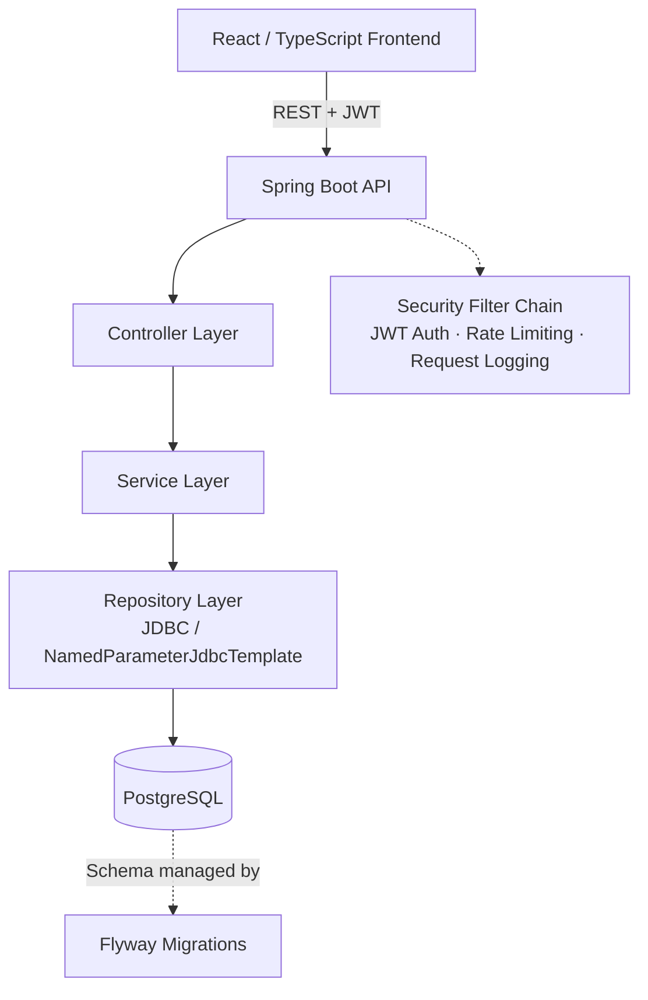

The backend deliberately uses plain JDBC (`NamedParameterJdbcTemplate`)
rather than JPA/Hibernate — every SQL statement is explicit, which keeps
the debt-ledger logic (row locking, directional balance updates)
predictable and easy to reason about.

### System Design (request path)

```
Browser
   │
   ▼
React Frontend (Vite dev server / static build)
   │  HTTPS + JWT Bearer token
   ▼
REST API — Spring Boot
   │
   ▼
Controller Layer  (validation, HTTP concerns)
   │
   ▼
Service Layer     (business rules, transactions)
   │
   ▼
Repository Layer  (JDBC — NamedParameterJdbcTemplate)
   │
   ▼
PostgreSQL
```

### Database ER Diagram

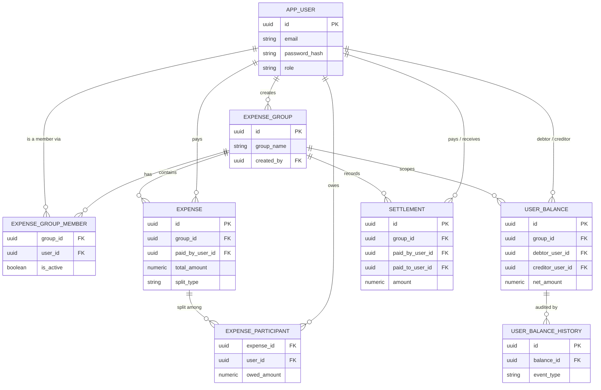

### Sequence Diagrams

**Login**

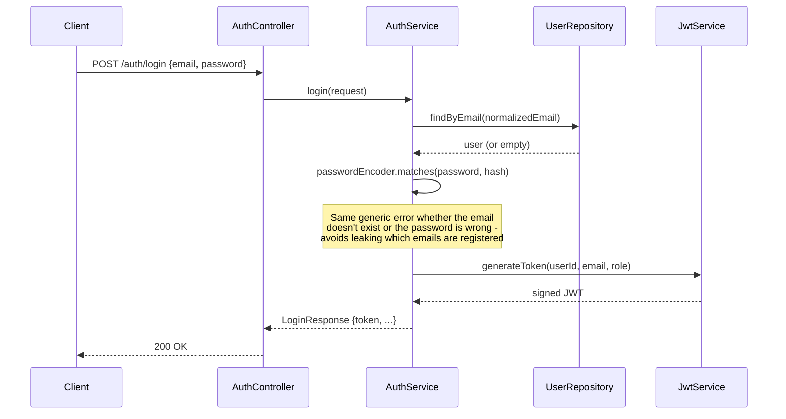

**Create Expense**

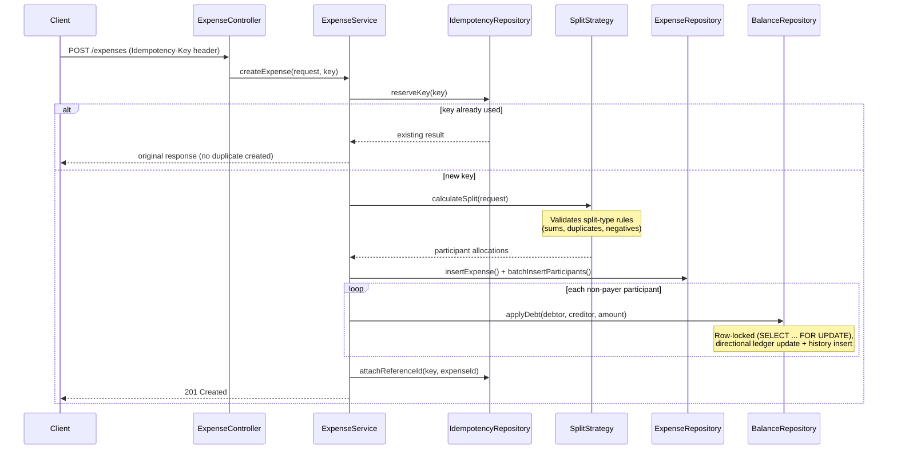

**Settlement**

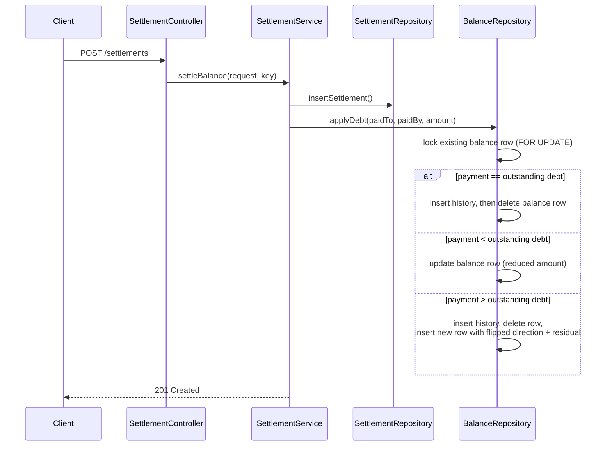

---

## Database

| Table | Purpose |
|---|---|
| `app_user` | User accounts, credentials, role |
| `expense_group` | Groups that expenses belong to |
| `expense_group_member` | Group membership (active/inactive) |
| `expense` | Expense records — amount, currency, split type, payer |
| `expense_participant` | Per-user share of each expense |
| `user_balance` | Current, directional, per-currency debt between two users in a group |
| `user_balance_history` | Immutable audit trail of every balance change |
| `settlement` | Recorded payments between users |
| `idempotency_record` | Tracks idempotency keys for safe request retries |

---

## Screenshots

> _Add screenshots to `docs/screenshots/` and update the paths below._

| Login | Dashboard |
|---|---|
| 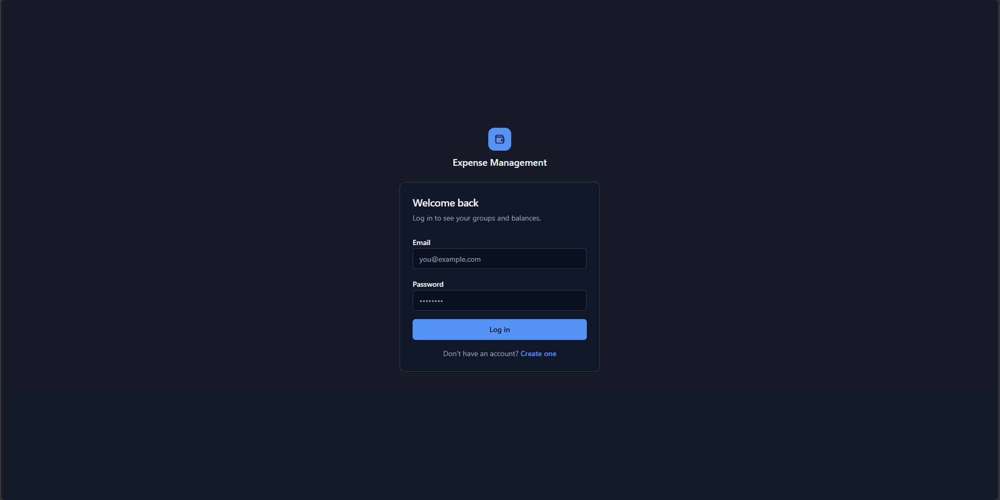 | 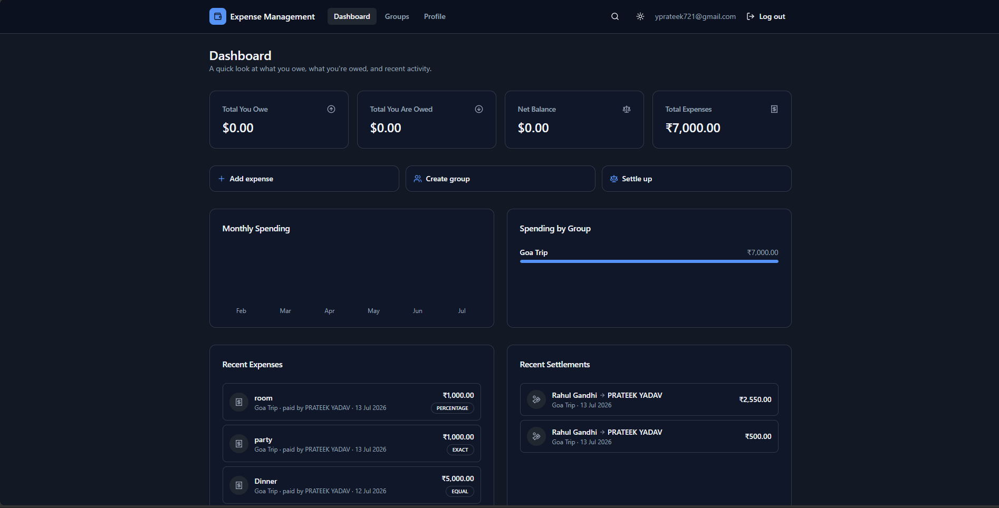 |

| Groups | Expenses |
|---|---|
| 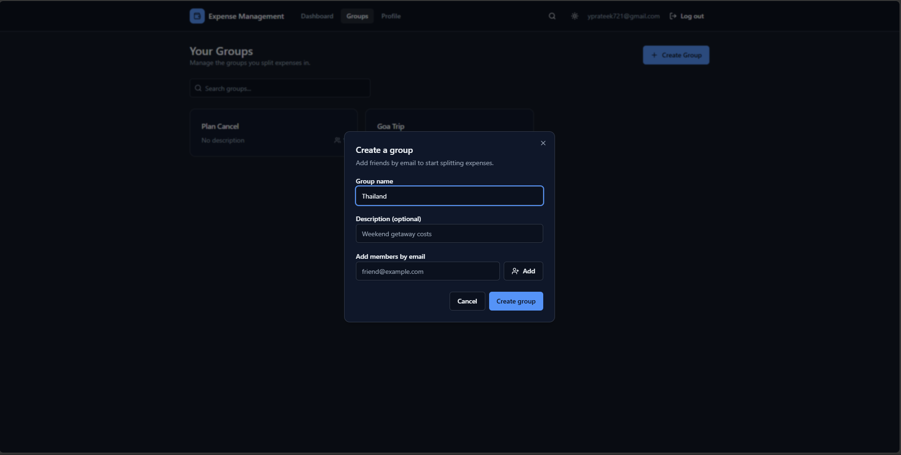 | 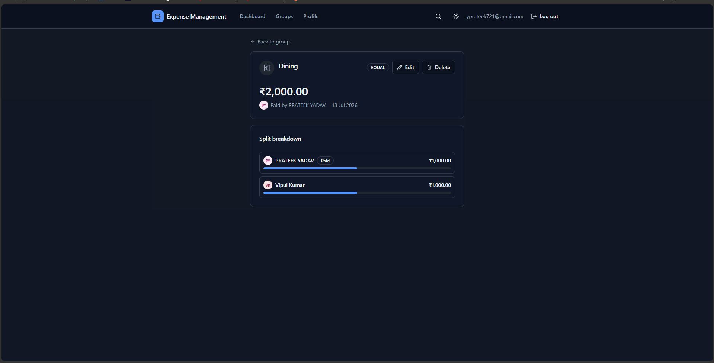 |

| Balances | Settlements |
|---|---|
| 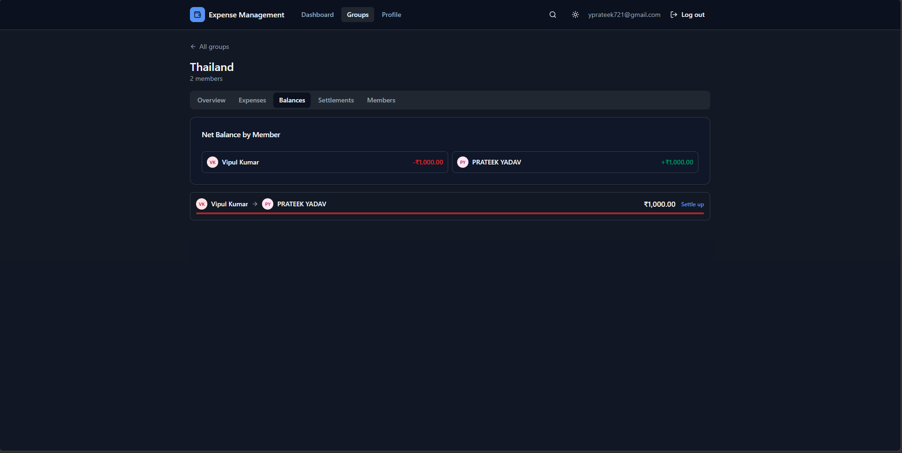 | 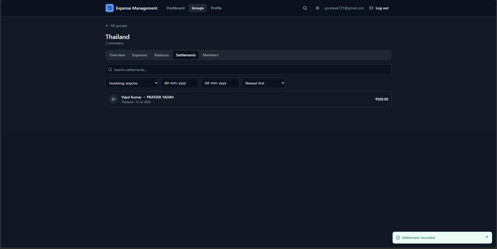 |

| Profile |
|---|
| 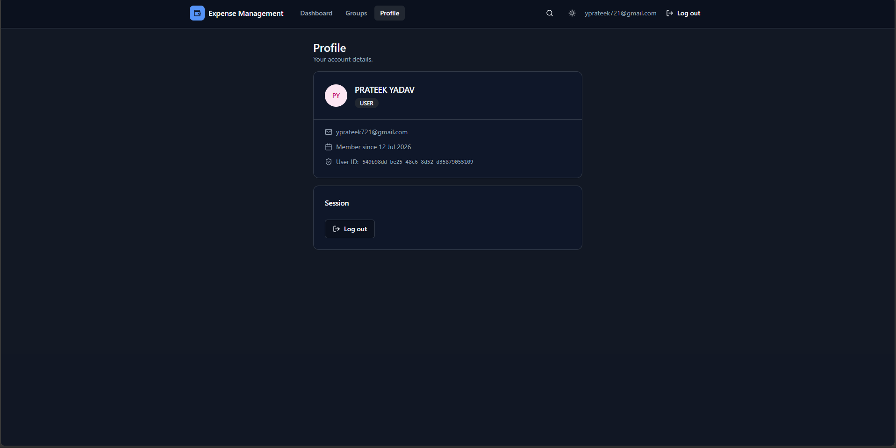 |

---

## Installation

### Using Docker (recommended)

```bash
git clone <repository-url>
cd ProjectExpenseManagement
cp .env.example .env   # fill in DB_PASSWORD and JWT_SECRET
docker compose up --build
```

This starts PostgreSQL and the Spring Boot API together; Flyway runs
migrations automatically on startup. The API is available at
`http://localhost:8080/api/v1`.

Then, in a separate terminal, start the frontend:

```bash
cd frontend
npm install
cp .env.example .env   # VITE_API_BASE_URL=http://localhost:8080/api/v1
npm run dev
```

The app runs at `http://localhost:5173`.

### Local Development (without Docker)

Requirements:
- Java 21
- Node.js 20+
- PostgreSQL 16

```bash
# Backend
export DB_URL=jdbc:postgresql://localhost:5432/expense_management
export DB_USERNAME=postgres
export DB_PASSWORD=your_password
export JWT_SECRET=your_secret
mvn clean install
mvn spring-boot:run
```

```bash
# Frontend
cd frontend
npm install
npm run dev
```

---

## Environment Variables

| Variable | Description |
|---|---|
| `DB_URL` | JDBC connection string for PostgreSQL |
| `DB_USERNAME` | Database username |
| `DB_PASSWORD` | Database password (required, no default) |
| `JWT_SECRET` | Secret key used to sign and verify JWTs (required, no default) |
| `JWT_EXPIRATION_MINUTES` | How long an issued JWT stays valid (default: 60) |
| `RATE_LIMIT_LOGIN_MAX` | Max login attempts allowed per window (default: 10) |
| `RATE_LIMIT_REGISTER_MAX` | Max registration attempts allowed per window (default: 5) |

`DB_PASSWORD` and `JWT_SECRET` intentionally have no defaults — the
application fails fast at startup if they aren't set, rather than
silently running with an insecure default.

---

## Running Tests

```bash
mvn clean test
```

Integration tests spin up a real PostgreSQL instance via
**Testcontainers**, so **Docker must be running locally** for the test
suite to pass. Tests cover expense creation across all three split
strategies, validation failures and their rollback behavior, full and
partial settlement, and idempotent request handling.

Frontend:

```bash
cd frontend
npm run test        # unit tests (Vitest)
npx playwright test # end-to-end tests
```

---

## API Overview

All endpoints are prefixed with `/api/v1`. Except for `/auth/login` and
user registration (`POST /users`), every endpoint requires an
`Authorization: Bearer <token>` header.

**Authentication**
```
POST /auth/login          Log in, receive a JWT
POST /users                Register a new user
```

**Users**
```
GET  /users/me             Get the authenticated user's profile
GET  /users/lookup?email=  Look up a user by exact email match
```

**Groups**
```
POST   /groups                          Create a group
GET    /groups                          List the caller's groups
GET    /groups/{groupId}                Group detail (members, metadata)
POST   /groups/{groupId}/members        Add member(s) to a group
DELETE /groups/{groupId}/members/{id}   Remove a member
GET    /groups/{groupId}/balances       Balances within a group
GET    /groups/{groupId}/expenses       Expenses within a group
GET    /groups/{groupId}/settlements    Settlement history for a group
```

**Expenses**
```
POST   /expenses              Create an expense (Idempotency-Key header supported)
GET    /expenses/{id}          Expense detail
PUT    /expenses/{id}          Update an expense
DELETE /expenses/{id}          Delete an expense
```

**Settlements**
```
POST /settlements   Record a settlement (Idempotency-Key header supported)
```

Example — creating an equal-split expense:

```json
POST /api/v1/expenses
{
  "groupId": "36f441e9-d7a7-46b4-beb5-2a08147b5270",
  "paidByUserId": "549b98dd-be25-48c6-8d52-d35879055109",
  "title": "Dinner",
  "totalAmount": 100.00,
  "currencyCode": "USD",
  "splitType": "EQUAL",
  "expenseDate": "2026-07-13",
  "createdByUserId": "549b98dd-be25-48c6-8d52-d35879055109",
  "participants": [
    { "userId": "549b98dd-be25-48c6-8d52-d35879055109" },
    { "userId": "8a1e2b3c-4d5e-6f70-8192-a3b4c5d6e7f8" }
  ]
}
```

---

## Folder Structure

```
ProjectExpenseManagement/
├── src/
│   ├── main/
│   │   ├── java/com/prateek/ProjectExpenseManagement/
│   │   │   ├── config/         # Security, CORS
│   │   │   ├── controller/     # REST controllers
│   │   │   ├── domain/         # Enums / domain types
│   │   │   ├── dto/            # Request/response DTOs
│   │   │   ├── exception/      # Custom exceptions + global handler
│   │   │   ├── logging/        # Structured request logging
│   │   │   ├── ratelimit/      # In-memory rate limiter
│   │   │   ├── repository/     # JDBC data access
│   │   │   ├── security/       # JWT filter, authenticated principal
│   │   │   ├── service/        # Business logic
│   │   │   └── strategy/       # Expense split strategies
│   │   └── resources/
│   │       └── db/migration/   # Flyway migrations
│   └── test/
│       ├── java/.../integration/  # Testcontainers integration tests
│       └── java/.../support/      # Shared test infrastructure
├── frontend/
│   └── src/
│       ├── api/          # Axios API clients
│       ├── components/   # Reusable UI components
│       ├── contexts/     # React context providers
│       ├── hooks/        # Custom hooks (data fetching, auth)
│       ├── layouts/      # Page layouts
│       ├── pages/        # Route-level pages
│       ├── routes/       # Routing configuration
│       └── types/        # TypeScript types (mirroring backend DTOs)
├── docker-compose.yml
├── Dockerfile
└── pom.xml
```

---

## Engineering Decisions

| Decision | Why |
|---|---|
| **Stateless JWT authentication** | No server-side session store to scale or invalidate; any instance can verify a request independently from the token alone. |
| **Plain JDBC over JPA/Hibernate** | The debt-ledger logic depends on precise, predictable SQL (row locking via `SELECT ... FOR UPDATE`, exact statement ordering). An ORM's lazy loading, dirty-checking, and generated SQL would make that harder to reason about and to write reliable tests for. |
| **Flyway** | Version-controlled, forward-only schema migrations — every environment (local, CI, prod) reaches the same schema state the same way, and the history is auditable. |
| **Docker & Docker Compose** | One-command, reproducible startup for both the app and its database, with a health-check gate so the app doesn't start before Postgres is actually ready. |
| **Testcontainers** | Integration tests run against a real PostgreSQL instance instead of an in-memory substitute (like H2), so they exercise the actual SQL, constraints, and locking behavior the app depends on. |
| **Idempotency keys** | Financial write endpoints (`POST /expenses`, `POST /settlements`) accept an `Idempotency-Key` header. A retried request with the same key returns the original result instead of creating a duplicate expense/settlement — important for a client that might retry on a timeout. |
| **Directional debt ledger** | `user_balance` stores *who owes whom*, not just a net number — this makes "who owes what" queries and partial/overpayment handling straightforward, rather than needing to net out a full transaction history on every read. |
| **Immutable balance history** | Every ledger change writes an append-only `user_balance_history` row, giving a full audit trail independent of the current balance state. |
| **Rate limiting** | A minimal in-memory, fixed-window limiter on `/auth/login` and registration, to blunt brute-force and signup-spam attempts without adding an external dependency like Redis. |
| **Structured (JSON) logging** | Every request is logged with a request ID (via MDC), making it possible to trace a single request's full path through logs — this is what made several of the bugs below diagnosable in the first place. |

---

## Engineering Challenges & Solutions

These are real issues found and fixed during development, not
hypotheticals:

**Challenge:** A fully-settled debt's balance row was correctly deleted,
but the accompanying audit-trail insert then failed with a foreign key
violation (`Key (balance_id)=... is not present in table "user_balance"`).
**Solution:** The history row was being inserted *after* the balance row
it referenced was deleted, so the foreign key was already dangling. The
fix was ordering-only: insert the history row (while the balance it
references still exists), then delete the balance — `ON DELETE SET NULL`
correctly nulls out the reference at that point instead of throwing.

**Challenge:** Settling a balance failed with "one or more users do not
exist," even though every user involved was valid.
**Solution:** The settling user is very often also the one recording the
settlement (`paidByUserId == createdByUserId`). The existence check built
its user-ID list with a plain `List.of(...)`, which allowed a duplicate
entry; comparing that count against a de-duplicated database result
always failed. Fixed by de-duplicating the list before the check — a
pattern the expense-creation path already used correctly.

**Challenge:** Unauthenticated requests to protected endpoints returned
`403 Forbidden` instead of the more correct `401 Unauthorized`.
**Solution:** Spring Security falls back to a default `403` entry point
when no `AuthenticationEntryPoint` is registered. Added one explicitly, so
"you're not logged in" (401) and "you're logged in but not allowed" (403)
are distinguishable — which matters for a frontend deciding whether to
redirect to login or show an access-denied message.

**Challenge:** Preventing duplicate expense/settlement creation on client
retry.
**Solution:** Idempotency keys, reserved transactionally before the write
happens, so a retry with the same key returns the original result instead
of creating a second record.

**Challenge:** Rollback safety — ensuring a failed expense creation never
leaves a partial row behind (an expense with no participants, for
example).
**Solution:** The whole operation runs inside a single `@Transactional`
service method; integration tests explicitly assert zero rows exist after
a deliberately-triggered failure, not just that the API returned an error.

---

## Live Demo

> _Add links once deployed._

| | |
|---|---|
| Frontend | _coming soon_ |
| Backend API | _coming soon_ |
| API Docs (Swagger) | _not currently included — see Future Improvements_ |

---

## Security Considerations

- Passwords are hashed (never stored or logged in plaintext)
- Login returns the same generic error for "no such user" and "wrong
  password," to avoid confirming which emails are registered
- `DB_PASSWORD` and `JWT_SECRET` have no defaults — the app fails to
  start rather than silently running with an insecure default
- All SQL is parameterized via `NamedParameterJdbcTemplate` — no
  string-concatenated queries
- CORS is restricted to the configured frontend origin, not wildcarded

## Known Limitations

- The rate limiter is in-memory and per-instance — it does not coordinate
  across multiple app instances behind a load balancer (documented
  in-code as a swap-in point for Redis or similar)
- No refresh tokens — a JWT is valid until it expires, with no
  server-side revocation
- Balances are tracked per currency but not converted between currencies
- No API documentation UI (Swagger/OpenAPI) yet

---

## License

Distributed under the MIT License. See `LICENSE` for details.
